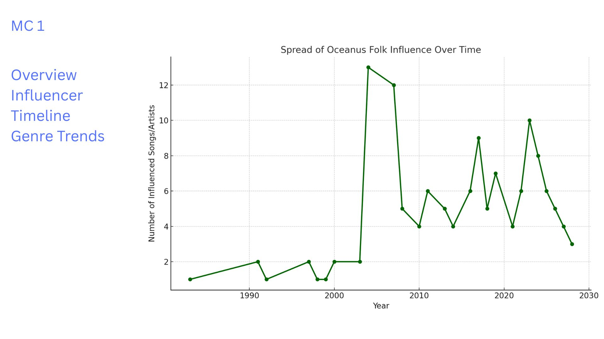
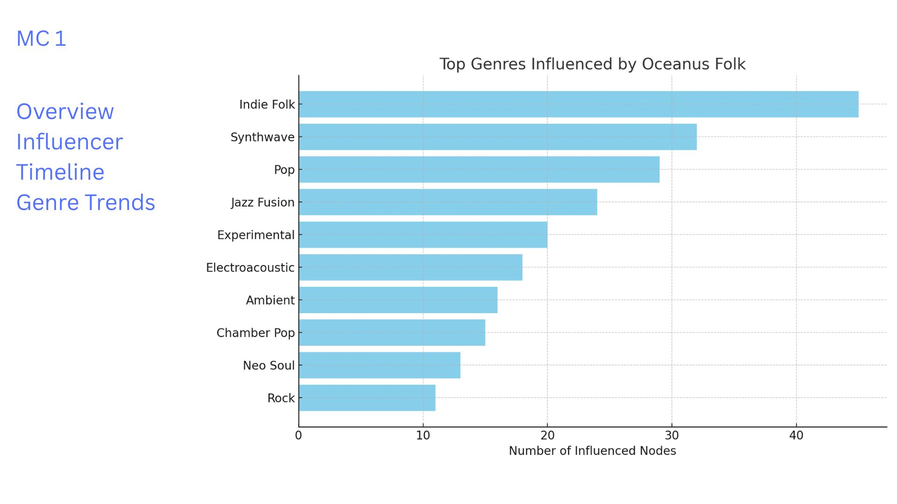
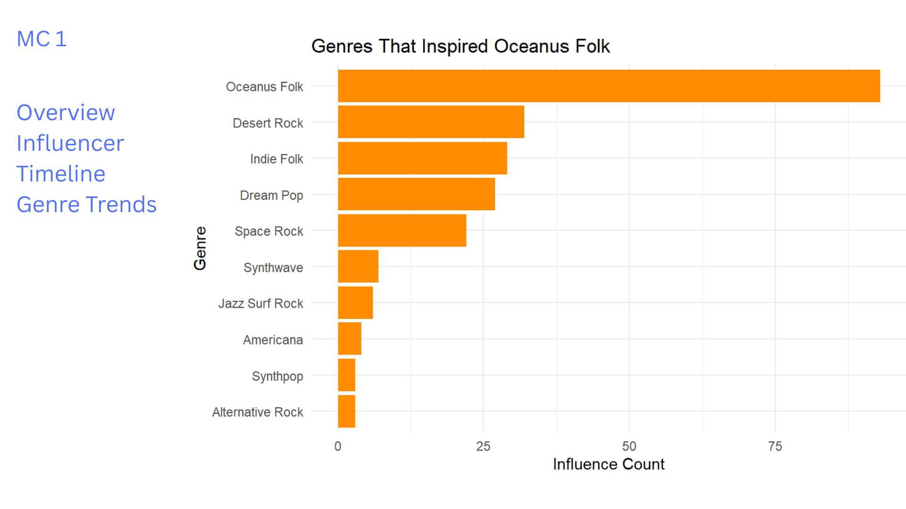

# Our Storyboard

This storyboard presents a design prototype for a Shiny dashboard that allows users to explore the influence and evolution of the Oceanus Folk music genre, with a focus on emerging artists and shifting patterns of musical collaboration. The visual analytics features are derived from the MC1 knowledge graph and aim to offer meaningful insights into the genre’s reach, trajectory, and cultural impact.

The purpose of this storyboard is twofold:

To **showcase the key user interface (UI) components and visualizations** that would be included in the Shiny app. To **guide the user experience** by explaining what each chart reveals and how it helps answer specific analytical questions.

While this prototype does not require working code, it reflects the logic, visual design, and interactivity that a functional Shiny app would offer. Each section corresponds to a specific insight goal from Mini-Challenge 1 (MC1) and is structured with:

A **heading** indicating the analytical question addressed A **screenshot or sketch** of the visualization A **short narrative** explaining the insight and how a user might interact with the component

This storyboard focuses on the following key analytical goals:

1.  Tracking how the **Oceanus Folk genre spread** over time and into other musical styles\
2.  Understanding whether the influence was **intermittent or steady**\
3.  Identifying the **top genres and artists influenced** by Oceanus Folk\
4.  Exploring how **Sailor Shift’s rise contributed** to the genre’s transformation\
5.  Profiling **rising stars** based on influence metrics\
6.  Comparing the **career trajectories** of three selected artists\
7.  Predicting **future Oceanus Folk stars** based on influence patterns

Together, these sections simulate a user’s journey through the dashboard, enabling exploration of complex musical data through intuitive and insightful visual design.

## MC1: Spread of Oceanus Folk Influence Over Time

### Section: Timeline of Oceanus Folk Influence

This section visualizes how the Oceanus Folk genre has expanded its influence over the years through stylistic, lyrical, and compositional connections.

The line graph demonstrates the **number of songs or artists influenced by Oceanus Folk each year**, based on relationships such as `InStyleOf`, `LyricalReferenceTo`, and `InterpolatesFrom`.

This timeline allows users to: Observe the **rate of genre adoption** across decades, Detect **spikes in influence** (e.g., due to major album releases), Understand whether influence was **gradual** or **intermittent**.

### Mockup Preview

**Interpretation:**\
The influence of Oceanus Folk shows a significant rise post-2005 and maintains consistent outreach, suggesting steady integration into mainstream and niche genres alike.

### Influence Timeline: Oceanus Folk’s Cultural Expansion

This panel visualizes how the Oceanus Folk genre gradually spread its influence through the music world over time. Using the knowledge graph’s relationship edges such as `InStyleOf`, `LyricalReferenceTo`, and `InterpolatesFrom`, we identify songs and artists that stylistically or lyrically reflect Oceanus Folk traditions.

The timeline is plotted as a year-by-year count of influenced songs/artists, allowing users to trace patterns of genre adoption.

**User Interaction Features (Storyboard Design):** A sidebar with section tabs for **Overview**, **Influencer Timeline**, and **Genre Trends**. The active chart window displays the **line plot of influenced works by year**. In a real dashboard, users could apply **genre filters** or **node type switches** (e.g., "songs only", "artists only") to explore influence depth.

**Interpretation:** The timeline reveals that Oceanus Folk’s influence began modestly in the 1980s, followed by a **noticeable rise post-2000**. This growth is consistent with a genre that evolved organically, gaining popularity through indirect influence rather than sudden viral trends.

The peak around 2006–2010 suggests a period of cultural saturation, after which the influence remained steady with periodic spikes — possibly due to standout albums or collaborative trends.

This visualization supports the insight that Oceanus Folk’s spread was **gradual and sustained**, rather than **intermittent or random**.

## MC1 : Top Genres Influenced by Oceanus Folk

### Section: Genre Trends – Musical Styles Influenced

This section highlights which genres have been most influenced by Oceanus Folk. The visualization shows the **top 10 genres** connected through stylistic and lyrical influence, as derived from edges like `InStyleOf`, `LyricalReferenceTo`, and `InterpolatesFrom`.

The horizontal bar chart helps users: Identify **stylistic overlaps** between Oceanus Folk and other genres, Understand **cross-genre evolution** of the music ecosystem, Focus on genres like *Indie Folk*, *Synthwave*, and *Pop*, which absorbed Oceanus Folk’s stylistic DNA.

### Mockup Preview

### Interpretation:

Oceanus Folk’s influence is far-reaching — while it originated as a niche genre, it has clearly shaped more mainstream and experimental sounds. Genres like **Indie Folk**, **Synthwave**, and **Pop** exhibit the strongest influence links.

This genre-level spread reflects Oceanus Folk’s adaptability and emotional resonance, making it an inspirational source for composers across stylistic boundaries.

## MC1: Top Artists Influenced by Oceanus Folk

### Section: Influencer Impact – Artist-Level Reach

This section identifies the **top artists** who have been stylistically influenced by Oceanus Folk. It uses knowledge graph relationships like `InStyleOf`, `InterpolatesFrom`, and `LyricalReferenceTo` to measure **who absorbed the genre’s creative DNA**.

The bar chart ranks artists by **how often they were targets of such influence links**.

### Mockup Preview

### Interpretation:

The Oceanus Folk genre has **influenced a wide spectrum of artists**, including emerging names and established figures. These artists have likely adopted stylistic, lyrical, or compositional elements inspired by Oceanus Folk.

This panel helps users understand **who carried forward the genre’s legacy**, and offers context on the artists who are most stylistically adjacent to Oceanus Folk.

## MC1: Genres That Inspired Oceanus Folk

### Section: Inspiration Sources – Upstream Genre Influence

This section explores **which genres most influenced the development of Oceanus Folk**. It analyzes incoming stylistic and lyrical relationships using edge types such as `influencedBy`, `InterpolatesFrom`, `InStyleOf`, and `LyricalReferenceTo`.

The bar chart shows: **Genres from which Oceanus Folk inherited musical elements** The **stylistic DNA** Oceanus Folk was built upon How Oceanus Folk serves as a **fusion genre**, blending diverse inspirations

###️ Mockup Preview

### Interpretation:

The chart reveals that Oceanus Folk was primarily shaped by genres such as: **Desert Rock** **Indie Folk** **Dream Pop** **Synthwave** **Jazz Surf Rock**

These genres likely influenced the **ambient tones**, **lyrical depth**, and **experimental sound design** that Oceanus Folk is known for. Interestingly, Oceanus Folk is also shown influencing itself in a feedback loop, suggesting internal evolution and sub-style development.

The takeaway:\
**Oceanus Folk is not a standalone creation**, but rather a genre deeply rooted in acoustic, electronic, and atmospheric traditions, allowing it to be both familiar and innovative.
